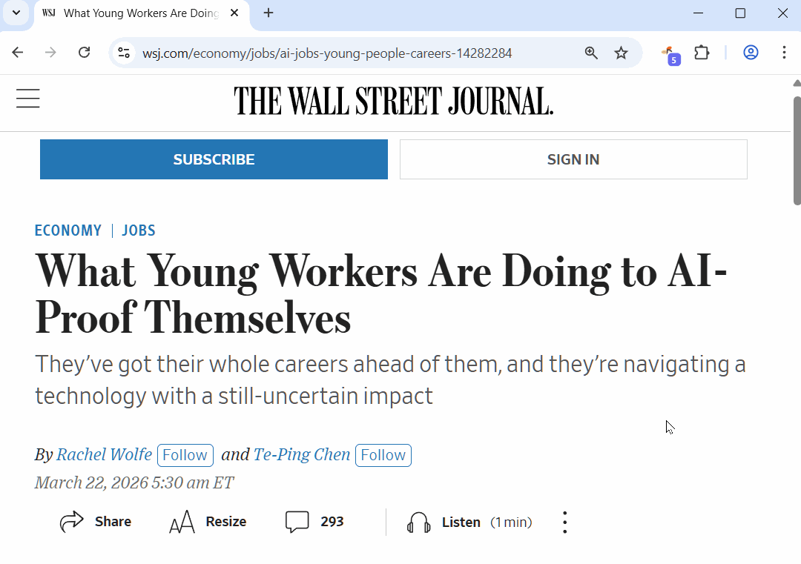
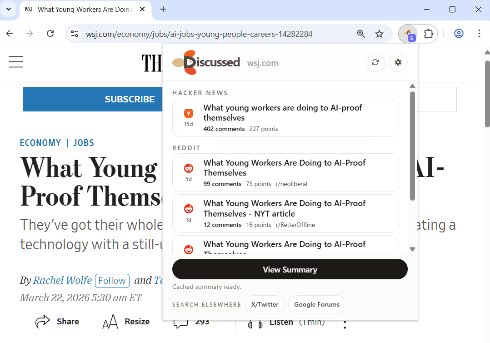
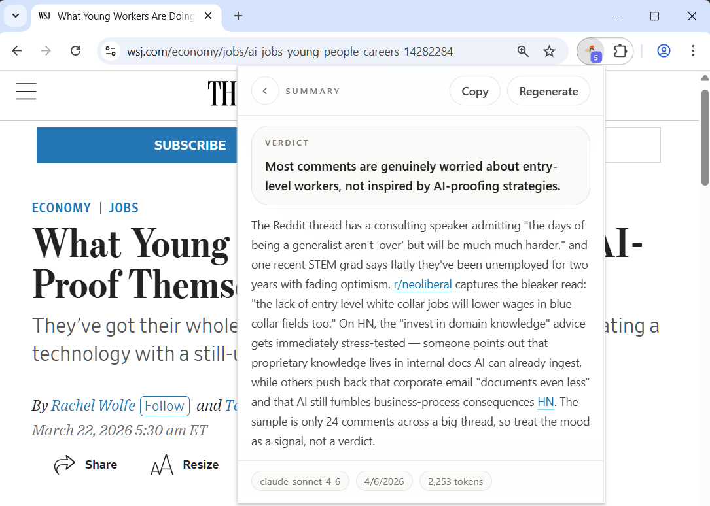
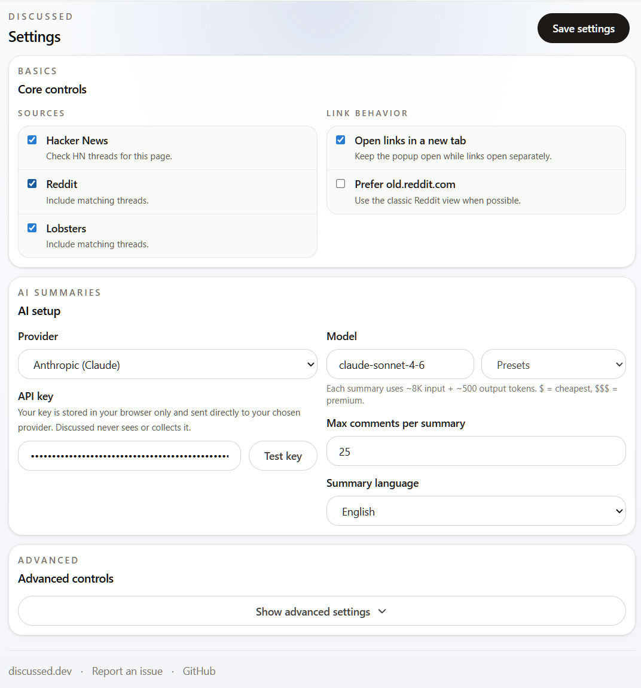

# Discussed

**Find HN, Reddit & Lobsters discussions about any page. Summarize community insights with AI.**

[](https://chromewebstore.google.com/detail/discussed) [](https://addons.mozilla.org/firefox/addon/discussed/) [](LICENSE)



## Features

- **Auto-discovery** — detects discussions on Hacker News, Reddit, and Lobsters as you browse
- **HN Bloom filter** — instant offline pre-screening of ~4.5M URLs, updated weekly
- **AI summaries** — one-click synthesis across all threads with 8 providers (Anthropic, OpenAI, Gemini, DeepSeek, Groq, xAI, OpenRouter, Ollama)
- **Bring your own API key** — no account needed, no data sent to our servers
- **Multi-language summaries** — English, Chinese, Japanese, Spanish, Korean, French, German
- **Badge at a glance** — color-coded by platform (orange=HN, blue=Reddit, red=Lobsters, purple=mixed)
- **Privacy-first** — no backend server, no analytics, no telemetry; all API calls go directly from your browser
- **Cross-browser** — Chrome, Firefox, and Edge from a single codebase

## Install

| Browser | Link |
|---------|------|
| Chrome / Edge | [Chrome Web Store](https://chromewebstore.google.com/detail/discussed) |
| Firefox | [Firefox Add-ons](https://addons.mozilla.org/firefox/addon/discussed/) |

Edge users can install directly from the Chrome Web Store.

### Build from source

```bash
bun install
bun run build          # Chrome
bun run build:firefox  # Firefox
```

Output is in `.output/chrome-mv3/` or `.output/firefox-mv2/`. Load as an unpacked extension in your browser.

## Screenshots

| Discussion list | AI summary | Settings |
|:-:|:-:|:-:|
|  |  |  |

## How it works

1. You visit a page
2. Discussed searches HN (via Bloom filter + Algolia), Reddit, and Lobsters in parallel
3. The toolbar badge shows how many discussions were found
4. Click the icon to browse threads sorted by engagement
5. Hit **Summarize All** to get an AI-generated cross-thread synthesis

All discovery runs locally. AI summarization only fires when you click the button.

## Tech stack

[WXT](https://wxt.dev) + [Svelte 5](https://svelte.dev) + [Tailwind CSS v4](https://tailwindcss.com) + TypeScript

## Privacy

- No backend server — all API calls go directly from your browser
- No analytics, telemetry, or tracking
- Your API key is stored locally in your browser and never leaves it
- The extension never injects content into web pages

## License

[MIT](LICENSE)
